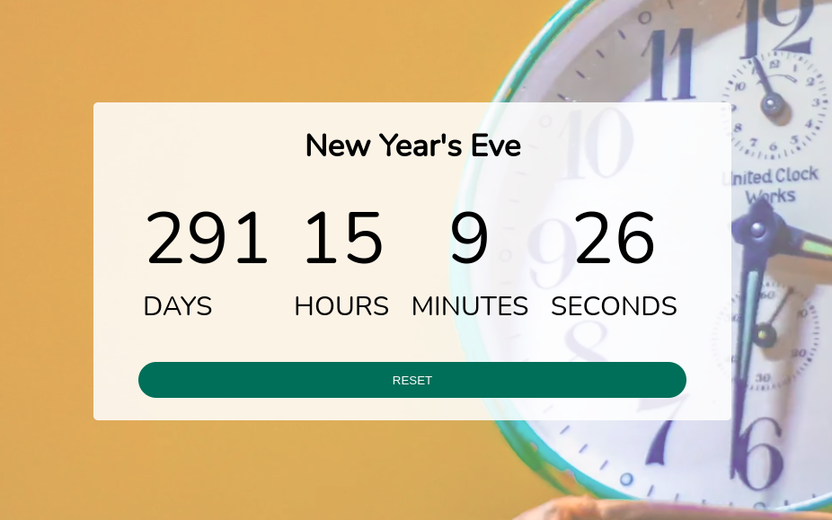

# basicJS_Custom Countdown: [LIVE DEMO](https://shcoobz.github.io/basicJS_custom-countdown/)

## Summary

Custom Countdown allows users to create and customize countdowns for various events or occasions. It features a user-friendly interface and essential functionalities for managing countdowns.

The core functionality includes:

- Creation of custom countdowns by specifying a title and selecting a date.
- Real-time countdown display showing days, hours, minutes, and seconds remaining until the event.
- Option to reset the countdown or start a new one after completion.

## Features

### Countdown Creation

Users can create custom countdowns by entering a title for the event and selecting a date using the date picker.

### Real-time Countdown Display

The application provides a real-time countdown display, updating every second to show the remaining time until the specified event.

### Countdown Reset

Users can reset the countdown at any time, clearing the current countdown and allowing them to set a new one.

## Technologies

- HTML/CSS: Used for structuring and styling the user interface.
- JavaScript: Implemented the countdown functionality and user interactions.
- Local Storage: Utilized for storing and retrieving countdown data between sessions.

---

_Note: This document provides an overview of Custom Countdown. For detailed instructions and more information, please refer to the source code documentation._

_This project has been enhanced and converted into a React-based application, which can be viewed [here](https://github.com/Shcoobz/advancedJS_custom-countdown/). The React version integrates more advanced state management and component-based architecture for improved maintainability and scalability._
